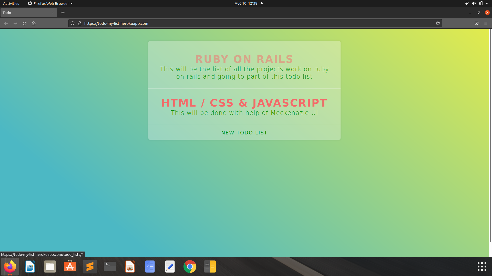
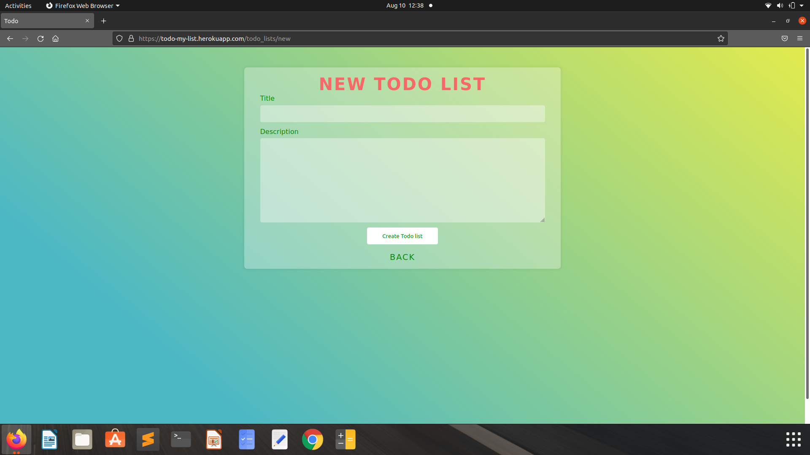
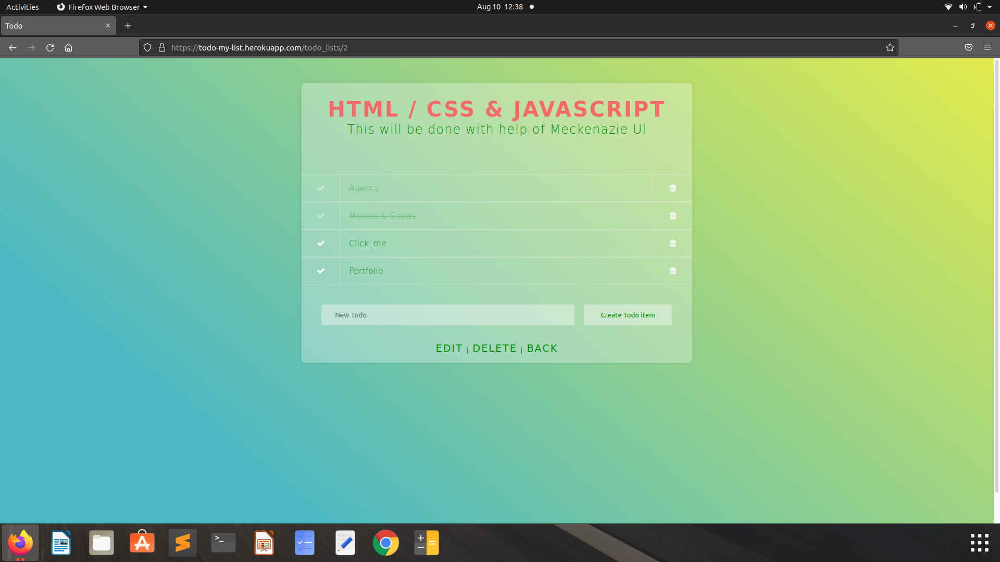

# Todo

This project is creating a todo list with Sass. It creates new list and if user need to remove it removes the list with nice user interface. 
###Checkout my project here https://todo-my-list.herokuapp.com
## Installation

Install my-project as zip or clone.

```bash
    git clone https://github.com/Yesh123456/todo.git
```

Install ruby and then Install rails.

https://www.google.com/url?sa=t&rct=j&q=&esrc=s&source=web&cd=&cad=rja&uact=8&ved=2ahUKEwjhob_M8aXyAhUvxDgGHYGNDeMQtwJ6BAgFEAM&url=https%3A%2F%2Fwww.youtube.com%2Fwatch%3Fv%3DdB6Xwjxct8Q&usg=AOvVaw0K9XoC9eQK0ChbdY6BBknG

Install bundle .

```bash
    bundle install
```
Create db and migrate schema.

```bash
    rake db:create
    rake db:migrate
```
Now run your app.

```bash
    rails s
```

RECOMMAND : USE RVM IF YOU ARE USING VARIOUS VERSIONS OF RUBY.
## Features

- Linear Gradient scheme
- Live previews
- Fullscreen mode
- Cross platform


## Screenshots







## Feedback

If you have any feedback, please reach out to us at isco30427@gmail.com

  
## Badges

Add badges from somewhere like: [shields.io](https://shields.io/)

[](https://github.com/tterb/atomic-design-ui/blob/master/LICENSEs)
[](https://opensource.org/licenses/)
[](http://www.gnu.org/licenses/agpl-3.0)

  
